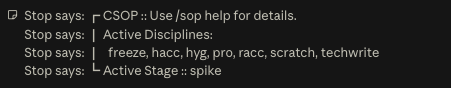
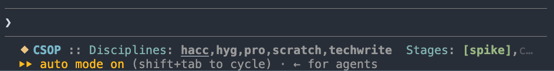

<table width=100%>
  <tr>
    <td colspan=2><strong>
    CSOP
      </strong>&nbsp;&nbsp;&nbsp;&nbsp;
    </td>
  </tr>
  <tr>
    <td width=15%></td>
    <td>
    Claude-SOP, or, Standard Operating Procedures.
    <br/><br/>
    "For SOP Against Slop, choosey choosers choose CSOP."
    </td>
  </tr>
</table>

Claude's native "modes" are things like *(plan | accept-edits | auto)* and they are a closed, built-in set.  

This repo tries to work around that using everything else that's available.  So what do you get?  A SOP is a group of active "disciplines", or, what you might call **user-space modes**.

Yup, a real person writes *most* of these docs, and curates the rest.  Be advised however that this is *definitely* a vibe-coded solution for vibe-coding problems.  I mean, come on, it is probably better than *nothing*, right?  Right?!

**Quick Links:** [The Problem](#the-problem-missing-user-modes) | [Enter CSOP](#enter-csop) | [Compare And Contrast](#compare-and-contrast) | [Examples](#examples) | [Install](#install) | [Discipline Details](#discipline-details) | [Configuration Layering](#configuration-layering) | [Abstractions](#abstractions) | [Misc Notes](#misc-notes)

## The Problem: Missing User Modes

Hooks, skills, and plugins are forever working at this layer that is not quite right.  And once you start thinking about a *mode*, a few things click into place:

* Needing one mode implies many others
* Many modes implies the need to activate or deactivate *subsets* of modes
* Modes need overridable config per-mode and / or possibly per-project

**Modes are not prompted roles!**  Or at least not *only* that.  The whole point of retreating from pretty-please prompting is that AI ignores instructions, will never permanently remember project conventions if they differ substantially from training, and all of this only gets worse as the weight of context increases.  Repeated nudging helps but isn't reliable.. **Everything needs gates, hooks, phases, protocols.**

Modes govern capabilities, but also suggest a kind of lifecycle beyond a turn and something that persists until disabled, etc, etc.  Good ideas!  But.. can you hook into Claude's existing mode?  **Not really.** Hooking just the status line works in newer CLI versions, but not in the app.  And the status-line, which we need to know what modes are active at any given time, is only a piece of the puzzle.

Anyway.. who cares?  Everyone should!  There's a lot of possibilities between read-only and full auto.

**What about Agents?**  Subagents (i.e. `.claude/agents/*.md`) are the closest *native* thing to a user-defined mode.  They provide a name, a system prompt, allow-lists for tools.  Still a role though and not yet a mode!  It's the granularity/layer problem again.  Tools-governance is coarse.. it can say "no Bash", but not "Bash *only for `tox`*".  An agent is a *delegate you spawn for a task*, not a persistent constraint that could hard-block your next tool call.  Skill me no skills if they are still just prompts.  There's little room for determinism, or CI-style progressive guarantees andd ratcheting gates.  More on that later.

## Enter CSOP

With Claude's real mode internals unavailable for extension, this plugin fakes it by using everything else that *is* available, and allows for configuring, activating, and deactivating progressive *layers* of restrictions.

* **A Discipline** is a structured group of *permissions, prompts, hooks, pre-turn nudges, and post-turn reminders*.

* **A SOP** is a group of active disciplines, and `/sop` is the management tool.  

* **A Stage** is a named entry and associated configuration block.  There are potentially many stages, but typically 1 active at a time.  Config can activate, deactivate, or extend active SOP(s), basically allowing for override of per-discipline defaults.  Stages might be arranged into DAGs, but can also just be user-activated via `/stage ..`.


**UX:**. Current stage and active-disciplines are displayed in the user modeline.  Claude CLI vs the Claude application have different levels of support for this, but CSOP supports both.  

The application route must hook into the stop message, and so it looks like this:



The CLI application has more native support, so it looks like this:



## Compare And Contrast

With definitions in hand, back to Claude's built-in agents for a second.  Those *can't be* a discipline.  But disciplines do *compose with agents*, since hooks fire inside subagents too.  A discipline then is.. basically the deterministic foundation any agent runs on, regardless of the rest of the prompts that are in play.

If the whole “stage” thing sounds like reinventing CI/CD, well yeah, wouldn't it be nice to avoid this?  Some might like the idea of bolting on **actual CI** and a whole evented subsystem for this sort of thing better.  Sounds fun! But again it's likely to hit that layer/granularity mismatch thing, e.g. a post-commit vs a pre-edit hook is quite a different thing, and sometimes you can't just compromise here and accept problems "temporarily" to be corrected "later, maybe, if token budget permits".  

**A modest proposal:** Before you propose to manage a swarm autonomously on *any* project with.. *gestures vaguely*… you might want to start with effectively steering something small, on a per-project basis, in an automatic or semi-automatic kind of way.

## Example Disciplines

List below is incomplete!  Lots of in-flight WIP and experiments are in the repo, so the stuff here is just the things that are starting to feel more stable and definitely worthwhile.  Things you can click are more mature, and offer more extensive docs.

| Discipline | Codename | Default | Code | Summary |
|---|---|---|---|---|
| **[Human Accountability](#human-accountability)** | `hacc` | on | [code](hooks/csop-gate-git.py) | Git is read-only for the agent. |
| **[Robot Accountability](#robot-accountability)** | `racc` | on with `hyg` | [code](hooks/csop-gate-racc.py) | No hiding diffs:  file changes must go through the Edit/Write tool (a visible diff), not in-place shell mutations. |
| **[Memory Accountability](#memory-accountability)** | `mem` | opt-in | [code](hooks/csop-gate-mem.py) | Memory formation is a human decision: a write to a memory path asks first, is denied, or is reported, per `mode`. Implies `racc`. |
| **[Generative Hygiene](#generative-hygiene)** | `hyg` | on | [code](hooks/csop-gate-hyg.py) | Curbs externalization of chain-of-thought in code comments.  Implies `racc`. |
| **[IsolatedTree](#isolatedtree)** | `iso` | opt-in | [code](hooks/csop-gate-isowrite.py) | Risky/exploratory/experimental changes to a project's core must be prototyped in an isolated git worktree (an 'iso-tree') under the crash-safe, in-repo, gitignored `home` (default scratch/iso/), never /tmp. |
| **Scratch** | `scratch` | on | [code](hooks/csop-gate-scratch.py) | Discourages/denies destructive commands, directing agent to use scratch folder. |
| **Promotion** | `pro` | opt-in | [code](hooks/csop-gate-promotion.py) | Changes to core should be deliberate promotions of work proven in an iso-tree/scratch (small, tested, reviewable diffs), not ad-hoc edits. |
| **[Frozen Features](#frozen-features)** | `freeze` | opt-in | [code](hooks/csop-gate-pathblock.py) | Protects frozen paths and file regions from access. |
| **Test-Driven Development** | `tdd` | opt-in | [code](hooks/disciplines.py) | Tests-first workflow. |
| **Feature Spike** | `spike` | opt-in | [code](hooks/disciplines.py) | A time-boxed, throwaway exploratory spike to de-risk or learn. |
| **Performance** | `perf` | opt-in | [code](hooks/disciplines.py) | Measure-first performance discipline. |
| **Tactical Retreat** | `tactical` | opt-in | [code](hooks/disciplines.py) | When a change/experiment is going badly, cleanly retreat to a known-good state and rethink instead of accumulating hacks or churning flip/revert/flip. |
| **Stepwise** | `step` | opt-in | [code](hooks/disciplines.py) | Small-increment method. |
| **Consensus** | `consensus` | opt-in | [code](hooks/disciplines.py) | Corroboration / multi-perspective method. |
| **Groomer** | `groom` | opt-in | [code](hooks/disciplines.py) | Behavior-preserving style sweeps (conflicts with iso). |
| **[Technical Writer](#technical-writer)** | `techwrite` | opt-in | [code](hooks/csop-gate-techwrite.py) | Clear technical writing. |

The pattern with the more interesting stuff is generalizing a prompt-based role into something more like a legitimate *practice*.  (Do you prefer to trust a merely prompted "scientist" role, or one that's actually forced to step through the scientific method? 🤔)

## Install

Projects opt in to CSOP using plain files wired through `${CLAUDE_PROJECT_DIR}.  No marketplace, no plugin install, no manifest. Just put a checkout somewhere in (or reachable from) the project, then run `make install` **from** CSOP, **inside** the project folder.

**Requires Claude Code v2.1.196 or later.** 

### Install Via Submodule

Recommended.  People hate submodules, but this approach means a plugin-version is pinned and upgrades are a `git` command.  **You probably don't want to just trust me on this,** so just fork this plugin repo to your own ownership.

Technically the submodule can use any directory, but the natural thing is to put the plugin itself inside the your upstream client-project's claude folder, then do the project-integration from there:

```bash
git submodule add \
  https://github.com/mattvonrocketstein/claude-SOP .claude/csop \
&& make -C .claude/csop install
```

This merges CSOP's hooks and the `/sop` permission entries into the project's `.claude/settings.json` (paths pointing back at the submodule), preserving any settings already there, and creates the `/sop`, `/disc`, `/discipline`, `/stage`, `/promote`, `/demote`, and `/sop-disable` commands. The merge syncs rather than appends, so re-running it after an upgrade is safe. Then start a Claude Code session in the project and approve workspace trust once. (Install already appends `.claude/csop-state/`, the runtime state dir, to the project's `.gitignore`.)

The default disciplines activate immediately; opt into the rest with `/sop enable <name>`. Turn one back off with `/sop-disable <name>`, or `/sop-disable all`.

`/sop catalog` lists every discipline one line to a row, with a `*` on the active ones, and `/sop show <name>` prints one in full. Both answer instantly and exactly: [`csop-command.py`](hooks/csop-command.py), a `UserPromptSubmit` hook, runs the read-only verbs itself and blocks the prompt, so the harness never queries the model. Fixed text does not need a model to retype it, and a model asked to retype it may paraphrase instead. The mutating verbs keep the model path on purpose, since that is where the permission prompt lives.

Disabling is human-only. The agent can arm a discipline but never disarm one: an always-on rail, [`csop-gate-disarm.py`](hooks/csop-gate-disarm.py), blocks every route from a tool call to a smaller active set, including edits to csop's own state. A slash command reaches `disable` because its body runs a fixed command shape that the rail escalates to a permission prompt, and only a human can clear a prompt. Approve one only when you just typed the command yourself.


Upgrade later with `git submodule update --remote`; teammates run `git submodule update --init` after cloning.

### Without Submodule

Any checkout works the same way. Clone or copy the files anywhere and run the
same target:

```bash
git clone https://github.com/mattvonrocketstein/claude-SOP tools/csop
make -C tools/csop install
```

If the checkout lives OUTSIDE the project (a shared install used by several
repos, where the git superproject can't be detected), point `make install` at
the project root:

```bash
make -C /path/to/csop install DEST=/path/to/your/project
```

Either way the result is identical: `.claude/settings.json` plus the commands are
written into the project, and each project keeps its own state and
`.claude/csop.json` overrides.

-------------------------------------------

## Discipline Details

### IsolatedTree

`iso` · opt-in · enable with `/sop enable iso`

Prototype risky, exploratory, or experimental changes to core in a **throwaway git
worktree**, prove them against tests there, then port only the clean diff back,
so a failed experiment never touches core.

**Lifecycle**

- **Fresh tree per task**: `git worktree add scratch/iso/<name> <clean-base>`.
- **Iterate and test inside the tree**: commit work-in-progress freely; the tree is disposable.
- **Rebase onto core before promoting** (`git -C scratch/iso/<name> rebase <core>`), so the diff reconciles against current core.
- **Promote by edits**: hand-apply the proven diff into core files, never a git merge.
- **Discard the tree** once the diff has landed.

**Enforced restrictions**

- **Location**: a tree must live under `scratch/iso/` (crash-safe, in-repo, gitignored), never `/tmp`. A `git worktree add` elsewhere is blocked.
- **No reuse, session-owned**: the first write into a tree this session did not create is blocked. A leftover tree is stale or half-finished, so work must not begin there.
- **Sandbox git**: under Human Accountability, history ops confined to a tree (rebase, commit) are allowed; ops that escape it (`push`/`pull`, `gc`/`prune`/`filter-*`) stay denied, as does a merge or commit into core.
- **Reads are never gated.** Escape hatch: export `CSOP_ISO=off`.

**Config** (`.claude/csop.json`, project-overridable)

- `home`: where trees must live (default `scratch/iso/`).

### Frozen Features

`freeze` · opt-in · enable with `/sop enable freeze`

Protect stable or generated paths, and specific **regions inside a file**, from
edits. The `frozen` list is empty by default; a project fills it in
`.claude/csop.json`. Each entry is a bare path fragment (a file or a directory
subtree), or a mapping for finer control.

**Whole-path modes**

- `no-write` (default): the path may be read but not modified. Edit/Write/MultiEdit are blocked, as is a destructive shell verb naming it.
- `no-touch`: reads are blocked too (Read/Grep/Glob and Bash references), for a generated copy where reading the stale version is itself a trap. The message redirects to the entry's `use`, the real source.
- `no-restructure`: tool edits pass, since the subtree is meant to be edited in place, but a destructive shell verb (`rm`/`mv`/`cp`) naming the path is stopped.

An entry may carry `exempt` fragments (a worktree copy, say) that skip the shell check when they appear in the command or the invocation cwd. Path matching ignores a leading word character, so the fragment `.cmk/` is not found inside `foo.cmk/`.

**File regions**

- `regex`, a hard rule: a pattern bracketing the protected span, for example `<!-- FROZEN -->.*<!-- END -->`. A write overlapping a match is blocked; edits elsewhere in the file pass. `.` matches across lines.
- `prose`, a soft nudge: a description of the region, for example "the generated client stubs". Prose cannot be located precisely, so any write to the file emits a one-time reminder instead of a block.
- An entry may carry both: `regex` enforces, `prose` explains.

**Config** (`.claude/csop.json`, project-overridable)

- `frozen`: the list of entries; empty by default.
- `mode`: default mode for a bare-path entry (`no-write`).
- `action`: enforcement strength for whole-path and `regex` hits (default `block`; also `deny` / `ask` / `nudge`). Escape hatch: export `CSOP_FREEZE=off`.

```jsonc
"freeze": {
  "default_enabled": true,
  "frozen": [
    "src/legacy/",
    { "path": "build/_generated", "mode": "no-touch",
      "why": "materialized build artifact; regenerated at build time.", "use": "src/" },
    { "path": "config.py", "regex": "# FROZEN.*# END", "prose": "the credentials block" }
  ]
}
```

### Human Accountability

`hacc` · default-on (opt out with `"default_enabled": false`)

Git is read-only for the agent, so a human runs core git.

**Enforced restrictions**

- **Only read subcommands pass.** Each git call in a command is classified by its own subcommand. One on `read_list` (`status`/`log`/`diff`/`show`, plus `add` and `worktree`) passes; every other subcommand is blocked at the permission layer, as is a call the gate cannot classify (`git $CMD`). Because each call is judged alone, a deny word in an unrelated clause cannot block a read: `git log && make clean` passes.
- **Iso-tree carve-out.** When `iso` is active, a call directed into a tree with `git -C scratch/iso/<name>` is allowed (`rebase`/`commit`); ops that escape it (`push`/`pull`, `gc`/`prune`/`filter-*`) stay denied. The carve-out applies per call, so an iso-scoped read does not clear a core write beside it. Promotion into core is by edits, never a merge or commit.
- **Escape hatch:** export `CSOP_HACC=off`.

**Config** (`.claude/csop.json`, project-overridable)

- `read_list`: the only git subcommands the agent may run.
- `default_enabled`: on by default; set false to opt this project out.

### Robot Accountability

`racc` · opt-in, and co-activated by [Generative Hygiene](#generative-hygiene) · enable with `/sop enable racc`

The agent must change files visibly through the Edit or Write tool, which shows a
diff, not through in-place shell mutations. It is the robot counterpart to Human
Accountability: no sneaky edits by shell.

Because `hyg` is default-on, `racc` is normally active too. Hygiene and technical
writing inspect Edit and Write payloads only, so an in-place shell write would
otherwise be an unchecked path around them.

**Enforced restrictions**

- **In-place shell writes denied.** A Bash command that rewrites a file in place (`sed -i`, `perl -i`, in-place `awk`, `tee`, `dd`, `truncate`, or a `>`/`>>` redirect or heredoc to a file).
- **Other invisible writes denied.** A patch applied by `patch` or by git, a line editor (`ed`, `ex`), `install`, and an inline interpreter script (`python -c`, `node -e`, a `-` heredoc) that opens a file for writing.
- **Read-only shell passes.** A redirect to `/dev/null` or a file-descriptor dup is fine.
- **Escape hatch:** export `CSOP_RACC=off`.

**Config** (`.claude/csop.json`, project-overridable)

- `action`: enforcement strength (default `deny`).
- `default_enabled`: off by default.

### Memory Accountability

`mem` · opt-in · implies [`racc`](#robot-accountability) · enable with `/sop enable mem`

Memory formation is a human decision, not a side effect. A memory file outranks
instructions in every later session, so a wrong one, recorded from an error, a
flaky result, or a single-run observation, is expensive and quiet. The discipline
governs writes to the memory paths and makes each one either the human's call or,
at minimum, audible.

`racc` comes along because the gate sees Edit and Write only; without it a shell
redirect would write a memory unobserved.

**Modes** (`mode`, default `approval`)

- `approval`: the write asks the human first, quoting the proposed text. It rests on `ask`, which overrides every permission mode, so it holds everywhere.
- `amnesiac`: the write is denied outright. It rests on `deny`, which the permission layer ignores under `bypassPermissions`; if a write lands anyway, the reporter raises it as an alarm.
- `visible`: the write is allowed and named in the end-of-turn modeline. A memory can still form, but never in silence.

**Enforced restrictions**

- **Memory paths only.** A write is governed when its target matches `paths`: `MEMORY.md`, project and user `CLAUDE.md`, and any `memory/` directory. Every other write passes untouched.
- **Retraction passes.** An edit that only removes memory text is allowed under `allow_retraction`, which keeps correcting a bad memory cheap.
- **Landed writes are reported.** A PostToolUse reporter speaks under `visible` and `amnesiac`, quoting up to `excerpt_chars` of what was recorded.
- **Escape hatch:** export `CSOP_MEM=off`.

**Config** (`.claude/csop.json`, project-overridable)

- `mode`: `approval` (default), `amnesiac`, or `visible`.
- `paths`: the governed memory paths; project entries append to the defaults.
- `allow_retraction`: let removal-only edits through (default true).
- `excerpt_chars`: cap on quoted memory text in a prompt or modeline notice (default 200).
- `default_enabled`: off by default.

### Generative Hygiene

`hyg` · default-on (opt out with `"default_enabled": false`) · implies [`racc`](#robot-accountability)

Comment hygiene on agent-generated code. It rejects the tells of a model narrating to itself in the source: over-long comment blocks, code syntax quoted in comments, and shouted words. Reasoning belongs in a notes or spike doc under `notes_dir`, not in the code.

**Enforced restrictions** (added text only, so existing comments are left alone)

- **Two comment budgets, split by marker shape.** A comment attached to code (`#`, `//`, `--`, `;`) is chain-of-thought territory and gets `max_comment_lines`, default 1. Documentation, meaning a `doc_prefixes` line or a `doc_regions` region, gets `doc_max_comment_lines`, default 6, and skips the syntax rule since documentation legitimately shows code. Neither budget is unlimited. Where a block sits relative to what it documents is language-specific, so marker shape is the whole test: encode the distinction in `doc_prefixes`/`doc_regions`.
- **Counting rules.** Blank lines and bare delimiter lines cost nothing. A section banner ruled off with dashes separates runs rather than joining one. A block is judged at its *resulting* size, not the size of the diff, so it cannot be grown past budget by repeated small appends. A block already over budget can still be edited in place or shrunk, since only growth is refused; the message names the transition (`grew a documentation block from 11 to 12 lines`) and quotes the added line.
- **File type decides what counts as a comment.** The `comment_markers` table maps an extension to that language's line-comment markers: `#` for Python and shell, `//` for C-likes, `--` for SQL and Lua, `;` for Lisps. A language with no line comment maps to an empty list, so a CSS `#header` is a selector, and a `#` line in a `.js` file is not a comment either. Unlisted types fall back to `unknown_markers`.
- **No code in comments.** A comment matching a `syntax_rules` regex (a call like `foo(`, a shell or make sigil, an operator, braces) is rejected; describe it in prose.
- **No shouting.** An all-caps word used for emphasis is rejected; a real global or env-var keeps its underscores and passes, and acronyms live in `shout_ok`. This rule is *not* waived for documentation, because prose a human reads does not shout.
- **Scope.** Out: extensions in `prose_exts` (`md`, `markdown`, `mdx`, `rst`, `txt`, `adoc`, `org`), anything under a `prose_dirs` subtree (`docs/`), and the `notes_dir`. In: an iso tree under the notes dir, which holds code bound for core, so the promoted diff matches what core accepts. Markdown belongs to [Technical Writer](#technical-writer) instead.
- **Shell writes closed off.** Enabling `hyg` also activates [Robot Accountability](#robot-accountability), since this discipline sees only Edit and Write; without it, a `sed -i` or a heredoc would write comments it never reads.
- **Escape hatch:** export `CSOP_HYG=off`.

**Awareness.** The pre-turn `nudge` states the rule in one paragraph at the top of
every turn, so the model writes to it rather than discovering it by being
blocked. On rejection, the message lists each finding with the offending line,
then a tail assembled from only the rules that fired. There is no post-turn
`reminder`: reminders are for follow-up work a turn leaves behind, and a hygiene
violation is refused outright rather than deferred.

**Config** (project-overridable; see [Configuration layering](#configuration-layering))

- `max_comment_lines` / `doc_max_comment_lines`: the two budgets (default 1 and 6).
- `doc_prefixes` / `doc_regions`: what counts as documentation rather than a code comment.
- `syntax_rules`: the code-in-comment regexes. `shout_ok`: the all-caps words that pass (appends).
- `prose_exts` / `prose_dirs`: extensions and subtrees treated as prose and skipped (both append).
- `comment_markers` / `unknown_markers`: the per-file-type line-comment markers, and the fallback for a type not in the table.
- `notes_dir`: where reasoning should go instead (default `scratch/`).
- `action`: enforcement strength (default `block`).

### Technical Writer

`techwrite` · opt-in · enable with `/sop enable techwrite` (implies `hyg`, and `racc` through it)

Clear technical writing, plus a lint against generated-prose tells and code
leaking into docs. The nudge covers the usual moves: lead with the point, stay
concise, prefer active voice, structure with headings and lists, show with an
example. The enforcement half checks added text.

**Enforced restrictions**

- **Banned substrings, any file.** An added line containing a `banned` substring (default: the em-dash plus a handful of model tics) is rejected; these read as a machine, not a human.
- **Prose rules, scoped to docs.** In files matching `prose_globs`, each `prose_rules` regex flags code leaking into prose, such as a shell expansion or a bare `self.` anchor. Fenced blocks, backtick spans, Jinja, HTML code regions, and tables are masked first, so a signal inside a real code region is exempt.
- **Span strictness and opt-outs.** A rule with `in_spans` also checks inside backticks; a line carrying the `token` (default `docs-code-ok`) opts out; `exempt` basenames are skipped entirely.
- **Escape hatch:** export `CSOP_TECHWRITE=off`.

**Config** (`.claude/csop.json`, project-overridable)

- `banned`: substrings rejected in any added text, matched case-insensitively.
- `prose_globs`: which files the prose rules apply to (default `*.md`, `*.markdown`, `*.rst`, `*.md.j2`, `*.j2`).
- `prose_rules`: `{pattern, message, in_spans}` regexes for code-in-prose; empty by default.
- `discouraged`: prose-only words that warn without ever blocking (default `gate`, `leverage`, `substrate`).
- `token` / `exempt`: the per-line opt-out marker and the skipped basenames.
- `action`: enforcement strength (default `deny`).

-------------------------------------------

## Configuration layering

A discipline's identity lives in code; its behavior is tunable in three layers,
each overriding the one before it.

1. **Code default**: the class attribute in `hooks/disciplines.py`.
2. **Project**: `.claude/csop.json`, keyed by codename.
3. **Current stage**: the `stages` block's `disciplines` object for whichever stage is current, so a rule can be strict in one phase and relaxed in another.

Only the properties a discipline lists in `overridable` can be set; a name or
description never can. A property also listed in `append` **adds** to the value
below it rather than replacing it (`shout_ok`, `prose_exts`, `prose_dirs`,
`nudge`, `reminder`), so a project extends the built-in list instead of erasing
it. Everything else replaces.

```jsonc
{
  "hyg": { "doc_max_comment_lines": 12, "prose_exts": ["vue"] },
  "stages": {
    "draft":  { "disciplines": { "hyg": { "action": "nudge" } } },
    "polish": { "from": ["draft"], "disciplines": { "hyg": { "action": "block" } } }
  }
}
```

A stage becomes current via `/sop stage <name>` (or `/promote`), and the stage
layer applies to every gate that reads its discipline through `get()`.

-------------------------------------------

## Abstractions 

### Modeline

A plugin cannot drive the built-in status line, so `csop-modeline.py` (a `Stop`
hook) falls back to a footer at the end of each turn: a `CSOP ::` head carrying a
dimmed pointer to `/sop help`, then one row per body item, every row hung off a
box-drawing gutter column so the block reads as one unit under the host's own
preamble.

```
┏ CSOP :: Use /sop help for details.
┃ Active Disciplines: hacc, hyg, racc, scratch
┗ Active Stage :: core
```

`Active Disciplines` lists only what is on. `Active Stage` (shown when `pro` is
active and the project defines stages) names the current stage, or
`(none current)`. Any one-time notice prints above the box, under a `⬥`. Rows
wrap at a fixed inner width here rather than in the host, which wraps mid-word.
Markers, not styling, carry the meaning: the desktop app renders neither ANSI nor
markdown, so anything style-only is invisible there.

Silent when every component is empty. It never blocks (exits 0), so it cannot
cause a continuation loop.

**Two channels.** Raw `Stop`-hook stdout is not shown to the user, so the box and
its notices go out as the documented `systemMessage` JSON field, which Claude Code
renders as an end-of-turn notice. Post-turn reminders are addressed to the agent,
not the human, so they go out as `additionalContext` on the same hook instead.
That hands the turn back to the model so a reminder can be acted on rather than
merely displayed. The box prints on the return pass, which carries
`stop_hook_active`, so it appears once per turn and the handback happens once.

### Status line (opt-in, CLI only)

`csop-statusline.py` renders a one-line summary through Claude Code's
`statusLine` setting instead of a `Stop` hook, so it gets real ANSI color and a
real terminal width. It is CLI-only, and additive rather than a replacement:
`csop-modeline.py` stays wired for every surface.

```
⬥ CSOP :: Disciplines: hacc,hyg,racc,scratch  Stages: spike,[core],ship
```

Unlike the modeline, the `Stages` segment lists every stage the project defines,
with the current one in `[brackets]`.

It is deliberately **not** wired by `make init`/`make install`: `statusLine` is a
single-slot setting, and writing it into the shared, committed
`.claude/settings.json` would override a teammate's own status line the moment
they pull. Add it to `.claude/settings.local.json` in the project instead, which
Claude Code keeps out of git and which takes precedence over both the shared
`.claude/settings.json` and your `~/.claude/settings.json`:

```json
{
  "statusLine": {
    "type": "command",
    "command": "python3 \"${CLAUDE_PROJECT_DIR}/.claude/csop/hooks/csop-statusline.py\""
  }
}
```

Point the path at wherever the CSOP checkout lives in the project.

## Misc Notes 

### Compatibility

Needs Claude Code **v2.1.196+**: slash commands resolve `csop.py` through `${CLAUDE_PROJECT_DIR}`, which a command body substitutes only on 2.1.196+ (`make install` enforces this).
Hooks and the `python3` (stdlib-only) machinery run on any version.

### Self-protection

CSOP's own hook code under `hooks/` is read-only in a consumer project: an always-on gate denies Edit/Write of the vendored plugin copy, so fixes go upstream in the `claude-SOP` repo and reach the client by a submodule update. It is inert in the plugin's own repo. Escape hatch: `CSOP_SELFPROTECT=off`.

### Runtime / dependencies

Hooks are **stdlib-only** by policy. A plugin has no runtime-dependency
mechanism: a hook is a command the harness runs through the host shell, using
whatever `python3` is on PATH, with no venv, no container, and no install step.
The only prerequisite is a `python3` interpreter, already assumed by Claude Code,
so the plugin works on a fresh machine with zero setup.

- No third-party (`pip`) dependencies in hooks.
- No container per hook: PreToolUse fires on nearly every tool call, so container startup cost is prohibitive.
- If a future discipline needs a heavy dependency, vendor a pure-Python package onto `sys.path`, or bootstrap a venv in `${CLAUDE_PLUGIN_DATA}` from a SessionStart hook.
- With no `python3` on PATH the hooks fail open: the tool proceeds and the discipline is off.
